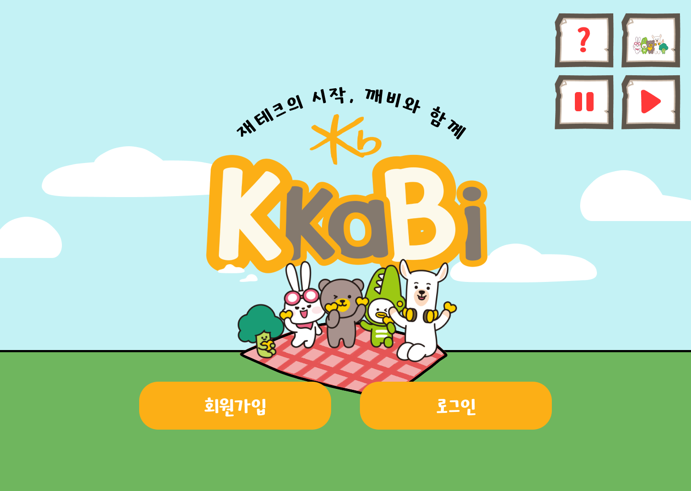
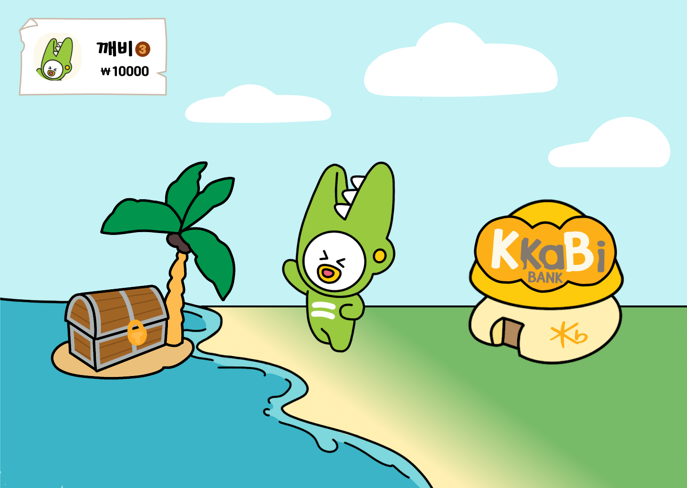
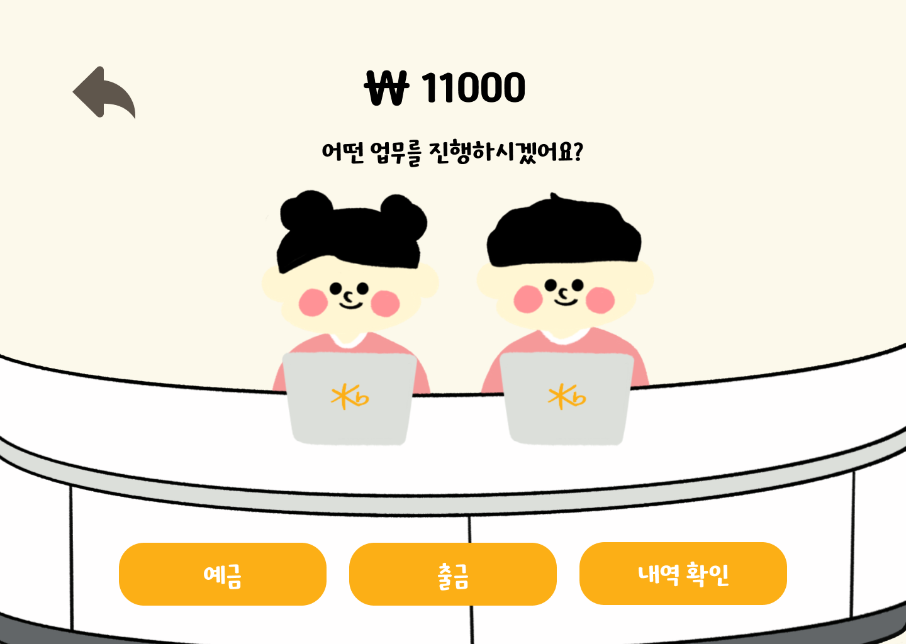
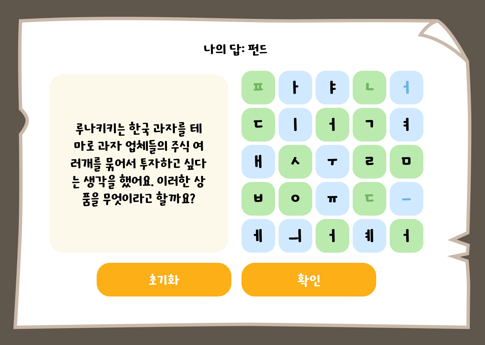

# KkaBi-Frontend
어린이의 경제관련 지식 습득을 돕는 웹 앱입니다.  
React, Vite, Recoil, TypeScript, 그리고 CSS를 이용해 구현되었습니다.   
[Notion Link](https://www.notion.so/seojisoosoo/af02cd56df7d4cc1ad7f42fcdc86c1c9)   
[시연 영상](https://youtu.be/4afc1a1zD58)   

  
## Installation and Setup Instructions
To Clone Repository:  
`git clone https://github.com/KB-KkaBi/KkaBi-Frontend.git`

Installation:  
`yarn install --frozen-lockfile`

To Start Server:  
`yarn dev` or `yarn vite`

## Commit Message Convention
이하의 명령어로 시작하는 커밋 메시지만 사용 가능합니다.(by husky)
| Tag Name | Description |
| ----------- | ----------- |
| feat | 새로운 기능이 추가되었을 때  |
| fix | 버그를 고친 경우 |
| design | css 혹은 UI를 생성 & 변경한 경우 |
| style | 코드 포맷 변경 (기능에 변화가 없는 경우) |
| refactor | 더 좋은 코드로 개선한 경우 ( 기능에 변화가 없는 경우) |
| docs | readMe 등 문서를 추가한 경우 |
| test | 테스트 코드 작성 |
| revert | 이전 커밋으로 돌아가려 할 때 |
| chore | build와 관련된 부분, 패키지 매니저 설정 등 여러가지 production code와 무관한 부분을 커밋 할 경우 |
| etc | 이 외 |

## Authors
- [JaeHyun Lim](https://github.com/JaeHyun-Lim-dev) - Front-end CTO, 초기 설정, 공통 컴포넌트/레이아웃 추가, 퀴즈 풀이 관련 화면, 기타 은행 화면 관련 퍼블리싱

## Project Status  
5/30 기준 개발이 완료된 상태입니다.
#### 개발이 완료된 기능:  
- 회원가입/로그인/로그아웃
- 계좌 개설
- 내 계좌 확인하기
- 예금
- 출금
- 투자 및 퀴즈 풀이
- 내 정보 확인하기
